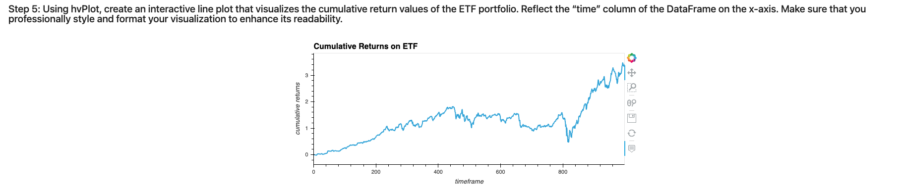
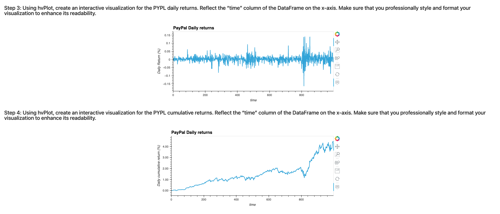

# ETF_Analyzer Application

## Background
 Passive investing allows you to invest in a basket of assets that’s called an exchange-traded fund (ETF). This way, you don’t spend time researching individual stocks or companies or take the risk of investing in a single stock. ETFs offer more diversification.

## Output

- The application outputs are created using Voila python package

#### Daily Returns
  

#### Cumulative Returns
  

---

## Technologies

The program is based on Python 3 and require the following libraries/packages to function

Jupyter Lab
JupyterLab is a web-based user interface designed for data analysis. It lets you write and run Python programs and then review the results—all in a single integrated development environment (IDE). JupyterLab works in association with the Anaconda distribution and the Conda package manager. You launch it from Terminal or Git Bash, and it then opens in a web browser window.

Pandas
Pandas is included when you use the Anaconda distribution and Conda package manager to manage your Python environments.

---

## Installation Guide

The user of the application will have to download Python,   Python package manager PIP and Git.

   - [How to install Python](https://www.python.org/downloads/) 
   - [How to install PIP ](https://pip.pypa.io/en/stable/installation/) 
   - [How to install Git ](https://git-scm.com/book/en/v2/Getting-Started-Installing-Git) 
   

---

## Usage

To use the application, follow the steps below.

1. Download the files from Github
    > mkdir etfanalyzer  
    > git clone [https://github.com/devops4cloud/SF_Rental_Analysis ](https://github.com/devops4cloud/ETF_Analyzer) 
    > cd etfanalyzer
   
2. Run the notebook etf_analyzer.ipynb

---

## Contributors

This application is Mario G.

---

## License

Copyright: N/A
